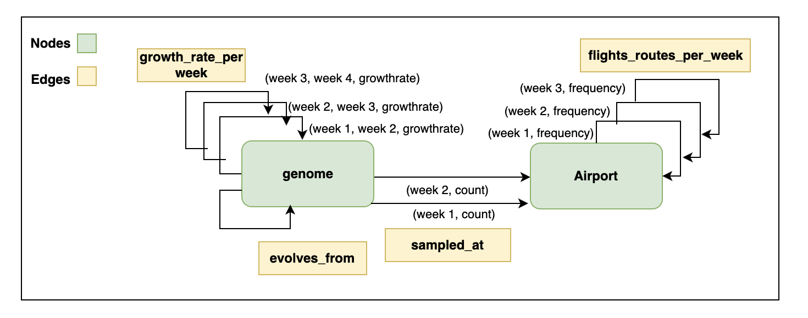

# HGT-BioGuard: COVID-19 Spread Analysis via Heterogeneous Graph Networks



## 🧬 Overview

**HGT-BioGuard** is a novel approach that combines **Heterogeneous Graph Transformers (HGT)** with genomic and flight data to analyze and predict the spread of SARS-CoV-2 during the early stages of the COVID-19 pandemic (January - April 2020). By integrating phylogenetic relationships with global flight networks, this project demonstrates how Graph Neural Networks can be applied to epidemiological surveillance and outbreak prediction.

## 🎯 Key Features

- **Heterogeneous Graph Construction**: Combines multiple data types (genomes, flights, locations) into a unified graph structure
- **Temporal Analysis**: Tracks virus evolution and spread patterns from January to April 2030
- **Phylogenetic Integration**: Incorporates evolutionary relationships between viral strains
- **Flight Network Analysis**: Maps global air travel patterns to predict transmission routes
- **GNN-based Prediction**: Uses state-of-the-art Graph Neural Networks for pattern recognition

## 📊 Methodology

### Data Sources

1. **Genomic Data**
   - SARS-CoV-2 sequences from GISAID database
   - 65,215 samples collected between January 1 - April 30, 2020
   - Pango lineage classifications for variant tracking
   - Phylogenetic trees showing evolutionary relationships

2. **Flight Data**
   - Global flight patterns from January - April 2020
   - Airport coordinates and connectivity information
   - Travel volume and route frequency data

3. **Geographic Data**
   - Location coordinates for genome samples
   - Country, region, and division information
   - Spatial distribution of variants

### Graph Construction

The heterogeneous graph consists of multiple node and edge types:

**Node Types:**
- **Genome Nodes**: Individual viral sequences with metadata
- **Location Nodes**: Geographic locations where samples were collected
- **Airport Nodes**: Flight hubs in the transportation network

**Edge Types:**
- **Phylogenetic Edges**: Evolutionary relationships between strains
- **Flight Edges**: Air travel connections between locations
- **Sampling Edges**: Links genomes to their collection locations

### Model Architecture

The project implements a **Heterogeneous Graph Transformer (HGT)** that:
- Processes different node and edge types with specialized attention mechanisms
- Captures both spatial and temporal patterns in virus spread
- Learns to predict transmission routes based on historical patterns
- Integrates biological and mobility data for comprehensive analysis


## 🚀 Getting Started

### Prerequisites

- Python 3.12 or higher
- Poetry (for dependency management)

### Installation

1. Clone the repository:
```bash
git clone https://github.com/tanzeel291994/HGT-BioGuard.git
cd HGT-BioGuard
```

2. Install dependencies using Poetry:
```bash
poetry install
```

Or using pip:
```bash
pip install -r requirements.txt
```

### Dependencies

Key packages include:
- `torch>=2.9.0` - PyTorch deep learning framework
- `torch-geometric>=2.7.0` - Graph Neural Network library
- `biopython>=1.84` - Biological sequence analysis
- `pandas` - Data manipulation
- `matplotlib` & `seaborn` - Visualization
- `scikit-learn` - Machine learning utilities
- `geopy` - Geographic calculations

## 📂 Project Structure

```
HGT-BioGuard/
├── data1/                          # Raw and processed data
│   ├── processed/
│   │   ├── df_genome_with_coords.tsv
│   │   ├── flights_with_airport_info.tsv
│   │   └── filtered_tree_before_april30_2020.nwk
│   ├── metadata.tsv.zst           # GISAID metadata
│   ├── sequences.fasta.zst        # Viral sequences
│   └── flightlist_*.csv.gz        # Flight data by month
├── visualization/                  # Visualization tools and outputs
│   ├── graph_explorer.html
│   ├── simulation.html
│   └── visualization.js
├── hgt-genomes-flights.ipynb      # Main analysis notebook
├── graphdata.ipynb                # Graph construction notebook
├── export_graph_to_json.py        # Graph export utility
└── pyproject.toml                 # Project dependencies
```

## 💻 Usage

### Data Preparation

1. **Process Genomic Data**:
The genome data is filtered to the date range of interest (Jan-Apr 2020) and cleaned:
```python
import pandas as pd

# Load genome metadata
metadata_df = pd.read_csv('./data1/processed/df_genome_with_coords.tsv', sep='\t')

# Filter by date and remove unclassifiable lineages
metadata_df['date'] = pd.to_datetime(metadata_df['date'], errors='coerce')
metadata_df = metadata_df[
    (metadata_df['date'] >= '2020-01-01') & 
    (metadata_df['date'] <= '2020-04-30')
]
```

2. **Load Flight Network**:
```python
flights_df = pd.read_csv('./data1/processed/flights_with_airport_info.tsv', sep='\t')
```

3. **Build Heterogeneous Graph**:
Run the graph construction notebook:
```bash
jupyter notebook graphdata.ipynb
```

### Running the Analysis

Open and run the main notebook:
```bash
jupyter notebook hgt-genomes-flights.ipynb
```

This will:
1. Load and preprocess genomic and flight data
2. Construct the heterogeneous graph
3. Train the HGT model
4. Generate predictions and visualizations
5. Export results for interactive exploration

### Visualization

View interactive graph visualizations:
```bash
cd visualization
./start_server.sh
# Navigate to http://localhost:8000/graph_explorer.html
```

## 📈 Results

The HGT-BioGuard model demonstrates:
- Accurate tracking of virus transmission routes
- Identification of key airports in disease spread
- Prediction of emerging hotspots based on flight patterns
- Integration of genomic diversity with mobility data

## 🔬 Scientific Applications

- **Pandemic Surveillance**: Early detection of transmission patterns
- **Public Health Policy**: Informing travel restrictions and testing protocols
- **Variant Tracking**: Monitoring the spread of specific lineages
- **Predictive Modeling**: Forecasting future outbreak locations

## 📄 Citation

If you use this work, please cite:
```
HGT-BioGuard: Heterogeneous Graph Transformer for COVID-19 Spread Analysis
Author: Tanzeel Shaikh
GitHub: https://github.com/tanzeel291994/HGT-BioGuard
Year: 2025
```

## 📝 License

This project is available for research and educational purposes.

## 🤝 Contributing

Contributions are welcome! Please feel free to submit pull requests or open issues for:
- Bug fixes
- Feature enhancements
- Documentation improvements
- Additional data sources

## 📧 Contact

For questions or collaboration opportunities:
- GitHub: [@tanzeel291994](https://github.com/tanzeel291994)
- Repository: [HGT-BioGuard](https://github.com/tanzeel291994/HGT-BioGuard)

## 🙏 Acknowledgments

- **GISAID** for providing SARS-CoV-2 genomic data
- **OpenFlights** for global flight network data
- **PyTorch Geometric** team for the GNN framework
- COVID-19 researchers and healthcare workers worldwide

---

**Note**: This project uses historical data from the early stages of the COVID-19 pandemic for research and educational purposes. The findings demonstrate the potential of Graph Neural Networks in epidemiological surveillance.

